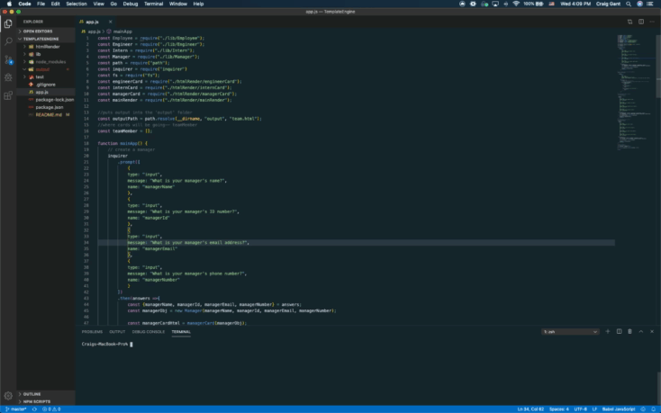

# TemplateEngine

This application is designed to dynamically generate an html page that contains contact information for a whole team. The user is prompted to enter the information upon initialization. Once the user adds all members of their team, the application dynamically creates a syled html document containing the information they entered.

## Interface
The user simply needs to answer the questions when prompted, and the application will then take over, dynamically creating an html file.

## Technologies
This site was written using:
* Node.js
* Inquirer
* Path
* Jest
* Javascript
* HTML
* CSS
* Bootstrap

## Credits
In setting up this project, I closely followed the guidelines provided by the [UCF Coding Bootcamp](https://github.com/UCF-Coding-Boot-Camp/UCF-ORL-FSF-FT-11-2019-U-C).